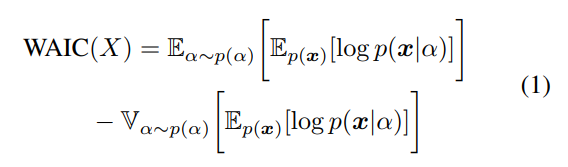
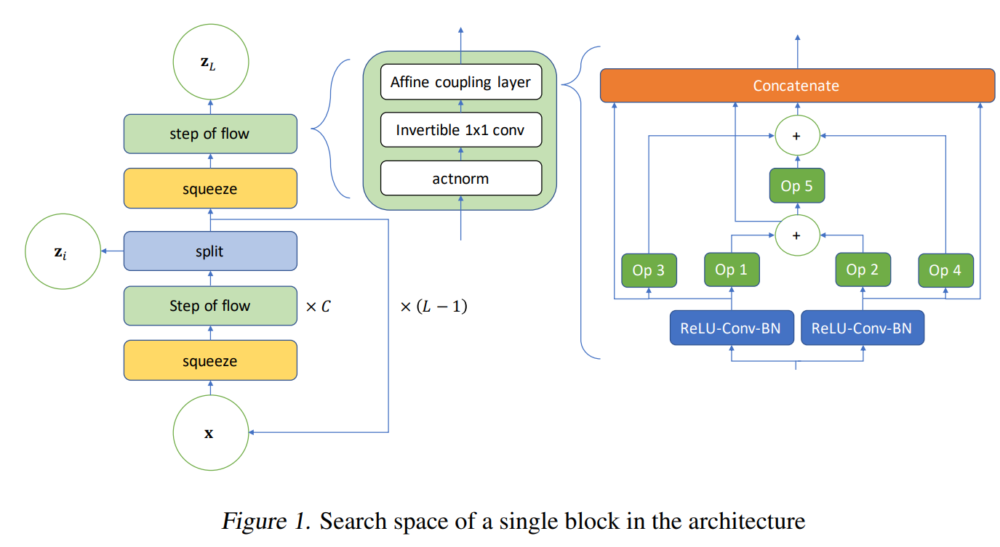
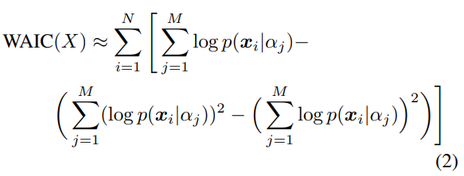
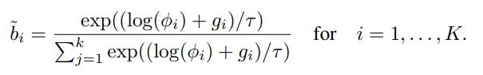

# NADS: Neural Architecture Distribution Search for Uncertainty Awareness

## Motivation

OOD detection is an important problem in Machine learning filed, while existing OOD method do not established guiding principle for designing OoD detection architectures that can accurately quantify uncertainty. To address these problems, we first seek to identify guiding principles for designing uncertainty-aware architectures, by proposing Neural Architecture Distribution Search (NADS). Which is the first approch that consider nueral architecture Search on OOD detection.

## Contribution
+ NADS **learns a posterior distribution on the architecture search space to enable UQ for better OoD detection**, instead of providing a maximum-likelihood point estimate to the best model. (**Main contribution**)
+ Design a novel **generative search space**n that is inspired by Glow [(Kingma & Dhariwal, 2018)](https://arxiv.org/pdf/1807.03039.pdf), which is different from previous NAS methods.
+ We use the WAIC score as the reward to guide the architecture search and provide a method to estimate this score for architecture search.
+ NADS yields state-of-the-art performance in multiple OoD detection experiments.

## Background
### Neural Architecture Search
Neural Architecture Search (NAS) algorithms aim to automatically discover an optimal neural network architecture
instead of using a hand-crafted one for a specific task. NAS consists of three components:
+ Proxy task: design of the proxy task is critical, include [leveraging shared parameters](https://arxiv.org/abs/1802.03268), [predicting performance using a surrogate model](https://arxiv.org/abs/1712.00559), and [early stopping](https://arxiv.org/abs/1611.01578)
+ Search space: searches for an entire architecture directly, or searches for small cells and arrange them in a pre-defined way
+ Optimization algorithm: [reinforcement learning](https://arxiv.org/abs/1712.00559), [Bayesian optimization](https://arxiv.org/abs/1806.10282), [random search](https://arxiv.org/abs/1809.04184), [Monte Carlo tree search](https://arxiv.org/abs/1704.08792), [gradient-based optimization methods](https://arxiv.org/abs/1905.01786).

While all existing NAS algorithms seek a single best performing architecture. In comparison, searching for a **distribution of architectures** allows us to analyze the common building blocks that all of the candidate architectures have.

### Uncertainty Quantification and OoD Detection
+ **Model-dependent** techniques aim to yield confidence measures p(y|x) for a model’s prediction y when given input data x. However, a limitation of model-dependent OoD detection is that they **may discard information regarding the data distribution p(x) when learning the task specific model p(y|x)**.
+ **model-independent** techniques seek to estimate the likelihood of the data distribution p(x). These techniques include Variational Autoencoders (VAEs), Generative Adversarial Networks (GANs), autoregressive models, and [invertible flow-based models](https://lilianweng.github.io/lil-log/2018/10/13/flow-based-deep-generative-models.html). Among these techniques, invertible models offer **exact computation of the data likelihood**, making them attractive for likelihood estimation.

## Neural Architecture Distribution Search
### Proxy Task
The first component of NADS is the training objective that guides the neural architecture search.  The WAIC score is a Bayesian adjusted metric to calculate the marginal likelihood. This metric has been shown to be robust towards the pitfall causing likelihood estimation models to assign high likelihoods to OoD data. The score is defined as follows:

  

Such a strategy captures model uncertainty in a Bayesian fashion, improving OoD detection while also converging to the true data likelihood as the number of data points increases.

### Search Space

  

NADS constructs a layer-wise search space with a predefined macro-architecture, where each layer can have a different architecture component. Each layer in macro-architecture consists of an actnorm, an invertible 1 x 1 convolution, and an affine coupling layer, and each operational block of the affine coupling layer is selected from a list of candidate operations. This part is a little different from [DARTS](https://arxiv.org/abs/1806.09055), NADS reduce the search space with 5 options such that can learn efficiently.

### Optimization
We are interested in finding a distribution $p_\phi(\alpha)$ parameterized by that minimizes the expected loss of an architecture \alpha sampled from it. For our NADS, this loss function is the negative WAIC score of in distribution data. Several difficulties arise when naively attempting to optimize this setup.
+ Firstly, the objective function involves computing an expectation and variance over all possible discrete architectures. We alleviate this problem by approximating the WAIC objective through Monte Carlo sampling. Specifically, we can sample M architectures and approximate the WAIC score expectation and variance terms as

  

+ Secondly, **Since we use Monte Carlo sampling in the loss function, which is naturally not differentiable for gradient descent. Here, we apply a reparameterization trick to make the sampling differentiable for SGD**. Specifically, we sue Gumbel-Softmax reparameterization, which is naturally suitable for categratical distribution sampling.

  

