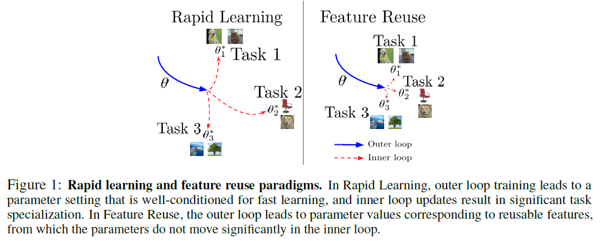
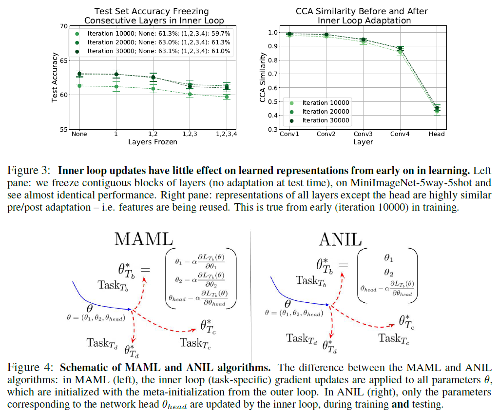

---
export_on_save:
 html: true
---
# RAPID LEARNING OR FEATURE REUSE? TOWARDS UNDERSTANDING THE EFFECTIVENESS OF MAML

## Motivation

An important research direction in machine learning has centered around developing meta-learning algorithms to tackle few-shot learning. An especially successful algorithm has been Model Agnostic Meta-Learning (MAML). Despite MAML’s popularity, a fundamental open question remains - **Is the inner loop optimization is necessary?** To answer this question, the conduct the ablation studies and analysis of the latent representations, finding that *feature reuse* (with the meta-initialization already providing high quality representations) is the dominant factor.

## Contribution
+ We perform layer freezing experiments and latent representational analysis of MAML, finding that **feature reuse is the predominant reason for efficient learning**. (**Main contribution**)
+ Proposed the ANIL (Almost No Inner Loop) algorithm, a significant simplification to MAML that **removes the inner loop updates for all but the head (final layer)** of a neural network during training and inference. ANIL performs identically to MAML on standard benchmark few-shot classification and RL tasks and **offers computational benefits over MAML**. (Kindly like transfer learning, only keep the head of the neural network)
+ We study the effect of the head of the network, finding that **once training is complete, the head can be removed**, and the representations can be used without adaptation to perform unseen tasks,
+ NADS yields state-of-the-art performance in multiple OoD detection experiments.

## Important Concept
### MAML
The MAML algorithm finds an initialization for a neural network so that new tasks can be learnt with very few examples (k examples from each class for k-shot learning) via two optimization loops:
+ **Outer Loop**: Updates the initialization of the neural network parameters (often called the meta-initialization) to a setting that enables fast adaptation to new tasks.
+ **Inner Loop**: Performs adaptation: takes the outer loop initialization, and, separately for each task, performs a few gradient updates over the k labelled examples (the support set) provided for adaptation.

More details refer to see this [blog](https://lilianweng.github.io/lil-log/2018/11/30/meta-learning.html#maml).

### RAPID LEARNING, AND FEATURE REUSE

  

where blue arrow is the outer loop update, and red arrow is the inner loop update. The rapid learning shows a long red arrow, which means a rapid update of inner loop. Contrast to rapid learning, feature reuse has a short red arrow, which means we a slight update of inner loop, e.g., freezing some layer when update.

## Main experiment result and ANIL

  

Since this paper's conclusions are from the empirical analysis. Here we show the main experiment result in Figure 3. The left fig shows the test accuracy with freezing different layer, and right fig shows the similarity before and after inner loop adaptation. **Both experiments show that feature reuse is important for MAML, i.e., only head layer is necessary to update, we can freeze other layer for inner loop adaptation. This observation is make sense because if we consider data generation processing, the cause relationship between layer and generate data, it would be some specific layer domain the adaptation.**

Based on this important observation, the authors proposed ANIL that only update head layer for inner loop adaptation, show in Figure 4.
